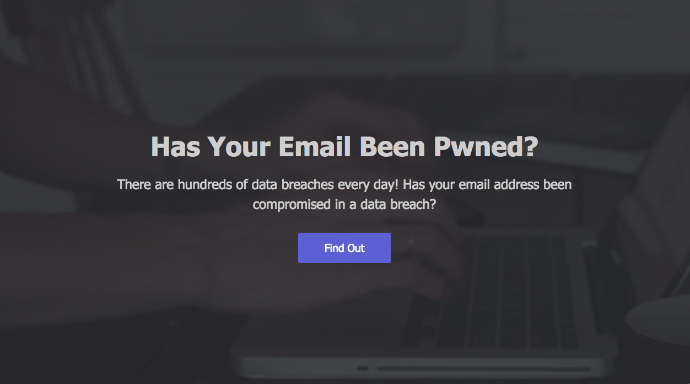
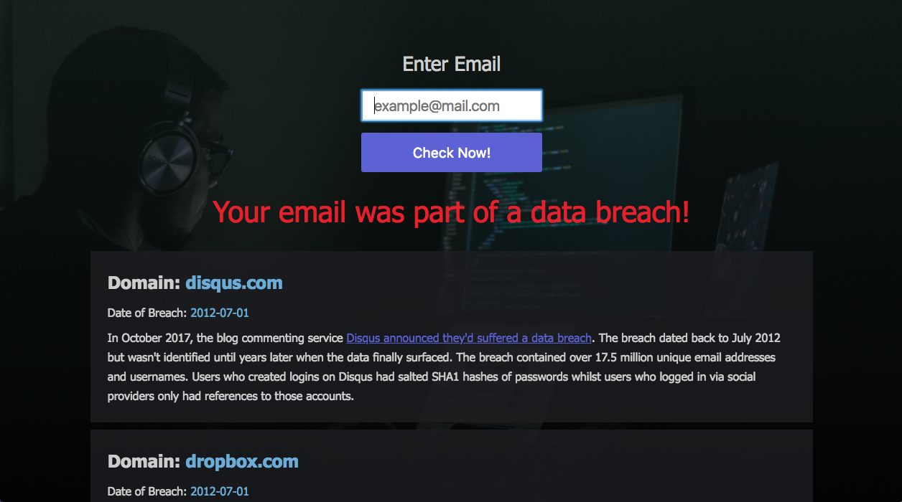

<h1>Data Breach</h1>

Ever wonder why you get all those spam emails? Your security might be up to date, but companies that you signed up for get hacked all the time. Usually in those hacks, millions of user information gets stolen. And then all of a sudden your inbox is full of spam email. 

This application uses an API offered by <a href="https://haveibeenpwned.com/">haveibeenpwned.com</a> which has information about data breaches for hundreds of websites.

Simply click the button to be guided to the input form

Enter your email and below you will find out if your email was ever compromised!

<em>Your email is never saved or used to send spam email.</em>

Technologies I used: 

<ul>
	<li>Html</li>
	<li>CSS</li>
	<li>Javascript</li>
	<li>jQuery</li>
</ul>